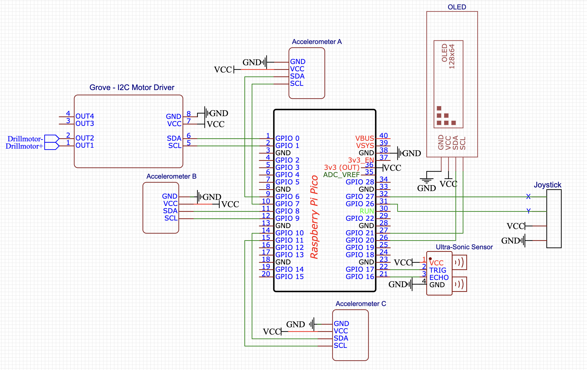

# Easier Drill
Our project introduces three key concepts: depth measurement, displacement measurement, and automatic drill shutdown. The measurements we provide are tailored for our primary audience: beginners and amateurs. They simplify the drilling process, taking care of tasks that would otherwise be performed separately, making drilling an effortless experience. You can say goodbye to measuring distances or fretting over whether your hole is too big for your screw.
 
A stripped screw in your wall, a frustrating situation that nobody (neither professionals nor amateurs) wants to deal with. That's why, our shutdown system ensures peace of mind for everyone by preventing the drill from stripping the screw. Our model dipense comfort, safety(for your wallet), versality(with the 3in1 structure) and efficiency(no need for other devices, nor additional hands). The functioning of these systems can be found in our firmware's block diagram.

The diagram can be broken down into 3 main parts: the collection and preprocessing of the data feed from the sensors, and the two processing cores of the Raspberry Pi Pico microcontroller. Our data feed includes the input from the ultrasonic distance sensor, the 3 accelerometers and the user interface(joystick).
 
The ultrasonic sensor's data is unprocessed, until the main control logic. For the joystick we have defined four different directions, which could be used to navigate a menu system. The accelerometers' mesurements are combined because this way accelerometer 'A' can be used as the center of movements and the other two can define the rotation around this center. This is accomplished by double integration using linear-/polinom approximation. The integral constants are given by the velocity and the displacement vectors respectively.
 
The first core of the microcontroller is mainly used for data extraction and handling the computationally cheaper tasks. This includes the ultrasonic sensor's whole algorithm, the data gathering part of the accelerometers and the handling of the user interface (inputs and calibration). The calibration is acomplished by taking into account the gravitational acceleration towards Earth, using trigonometry.
 
The second core calculates the position using the first core's calculations of the acceleration data. It also controls the screen for the user interface.
 
And now about the hardware. The connections between the electrical parts can be seen here in our schematic.

We also implemented a system to power the microcontroller from the drills battery.

And here is a futuristic plan for our implmentation.

 
The additional components include three acceleration meters, a Raspberry Pi Pico, an Ultrasonic Distance Sensor, a Thumb joystick, a Display board, and a printed circuit board. Based on our research on Alibaba, these components would cost approximately 19.2 USD at market price. The base EasyDrill 12 is priced at 70 USD, so the minimum cost for our enhanced drill would be 89.2 USD, which includes only the profit from the base model. We found the purchases of cordless drills in the last one month on Amazon.
For the development, 3000 USD would be enough, as for us🥺.
 
Our extension has clear safety and comfort features. The anti-screw stripping mechanism not only saves the customer from hassle, but in rare situations it can save considerable amounts of money as well. For example, if someone works on their bike, or any kind of engine, one stripped screw can mean hundreds of dollars of damage. The other two features are aimed at beginners and amateurs but make the product easier to use for anyone. The displacement measurement device eliminates the need for a tape measure, and the depth measurements ensures you, that the screws you put in the wall are stable. 
Is it feasible? We made the calculations and wrote the algorithms, but during the prototyping phase we ran into unexpected hardware limitations. With time these can be easily ironed out, but we had a very limited amount of that.

 
For our calculations we searched the components on Alibaba, but Bosch could probably get them for cheaper. We also used the retail price for the Easydrill 12. Putting those together means 90 USD is plenty to cover the manufacturing costs and should include a bit of profit as well.  To cover development and production costs, it would be more realistic, if it had a retail price between 100 and 120 USD. In the following section we’re going to assume a 110 dollar retail price, which should have a good profit margin.
 
We used Amazon's database because it’s free it has vast amount of data easily available for us. Specifically, we used Amz scout's chrome extension, to search for cordless drill, and listed the estimated number of units sold in the last month with current prices. Amz scout says it collects data from the North -American’s, the Mexico’s, the UK’s, France’s, Germany's, Spain’s, Italy’s, and India’s market. We found that, in the last month, there were more than 81000 units of cordless drill sold on Amazon, at the average price of 85 USD, with the total combined revenue almost at 7 million dollars. According to other researchers, Amazon has 37,8% market share in the online retail market, and only 64,3% of drill sales are through online stores. Using these numbers, we calculated that overall, there were 4.11x as much sales in observed markets. In our case that meant that more than 330 000 units were sold, and the revenue in total was more than 28.5 million USD. We divided the market into 3 separate categories: Low-end/cheaper than 70 USD, mid-range/between 70 and 125 USD, and high-end/more than 125 USD.  Assuming the same price distribution as on Amazon, low-end had the highest number of sales at 132 000, but mid-range had the most overall revenue of more than 12.2 million dollars. Our extension of the drill is more expensive, but we believe it’s price to performance ratio is competitive in the mid-range. Due to the almost same size and much bigger average price, capturing the same percentage of the market leads to almost 50% higher revenue in the mid-range compared to the low-end. Our research is far from perfect but considering that on the internet and especially on Amazon customers are more price-conscious, real data should be skewed in our favor. 
As we mentioned our target audience are non-professional drill users.